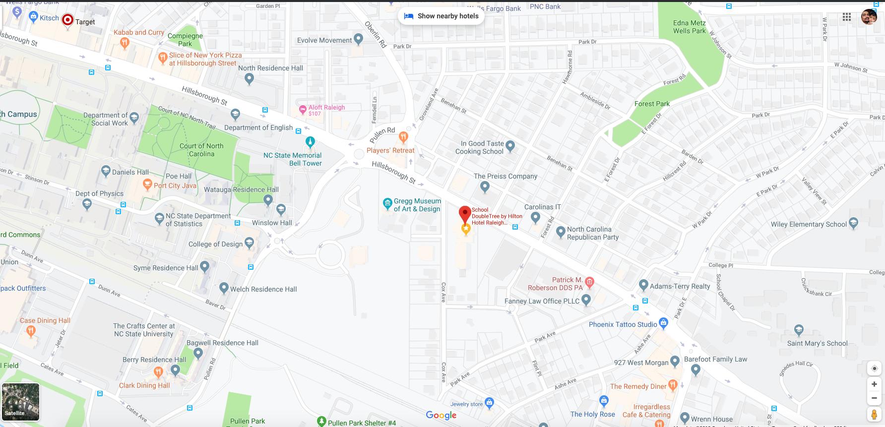

# onBoard
This is the name of the project. The app has been built as part of the course requirement for the Full Stack Flex program under UNC Chapel Hill's Web Development BootCamp. This project also concludes the program.

# Motivation
The idea of building **onBoard** was to provide a platform for people who love to play board games or even socialzie on board games. We found out there are not too many platforms in this segment to provide people with a chance to get together and get entertained. 

# Key Features
Some of the standout features of the project are
    1. Users can register and login
    2. Can create an event with game, place, time and date, and anything they want to let pople know
    3. Other users can see the events, take part in the discussion, can RSVP or not attend the game and even see the location on Google Maps
    4. Registered users can update or delete their profiles, can delete their events
    5. Users can also see the players, what games they are interested in and locations.

# Deployed Site
## [onBoard](https://quiet-fortress-68299.herokuapp.com/)

# Demonstration of key functionalities

### GIF walktrhough of the app:

### Screenshots of the app:

Landing page

Signup/Signup page
 

 

Dashboard
 

Posts page
 

 

Players
 

Single Player Profile
 

Update Profile
 

Discussions
 

Location on Google Maps

# Technologies Used

## Front-end

* HTML5
* CSS3
* SCSS
* React.js
* Redux
* Javascript
* Ajax
* Moment.js

## Back-end

* Node.js
* Express.js
* Axios.js
* MongoDB

# APIs Used:

* Google Maps

# How to use the app
You can fork the app or you can git-clone the app into your local machine. Once done that, please install all the dependencies by running 

`$ git clone https://github.com/gpiercelusk/onBoard`

`$ cd onBoard`

Install project dependencies:

`$ npm install`

Start the app:

`$ npm start`

# Contributors

* [Andrew Hennesen](https://github.com/AHennesen)
* [Deyon Shannon](https://github.com/dvshannon)
* [Bryant Coggins](https://github.com/bcoggins78)
* [Prasen Gope](https://github.com/prasengope)
* [Pierce Lusk](https://github.com/gpiercelusk)

# License
MIT